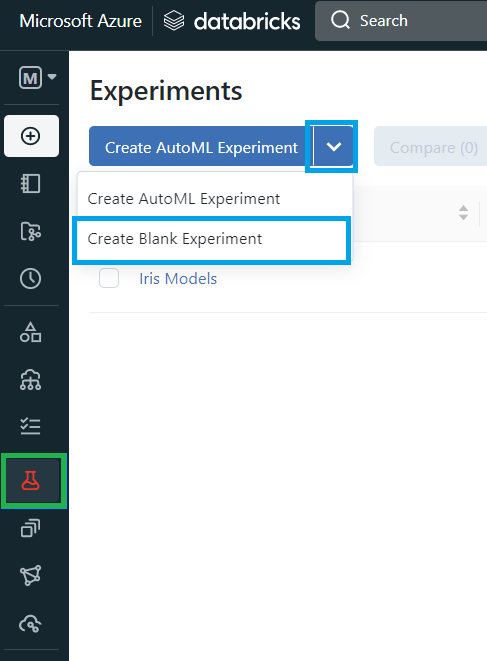
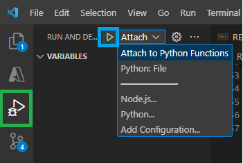
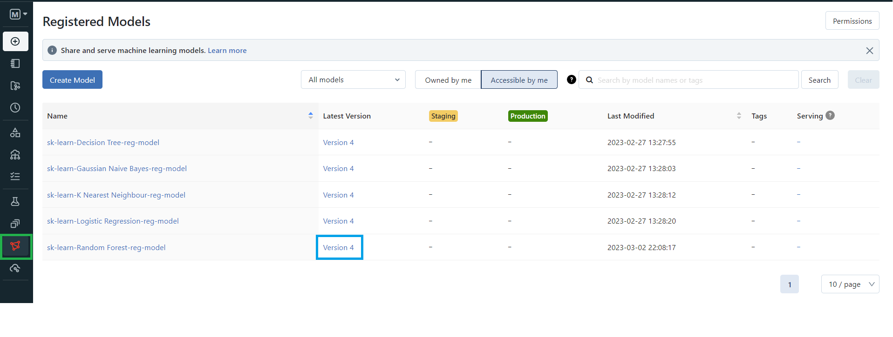
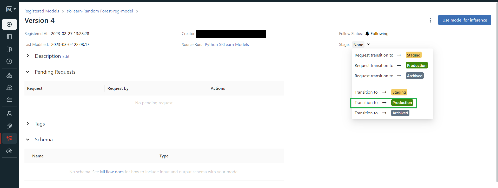
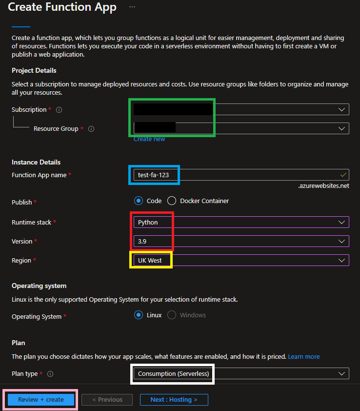
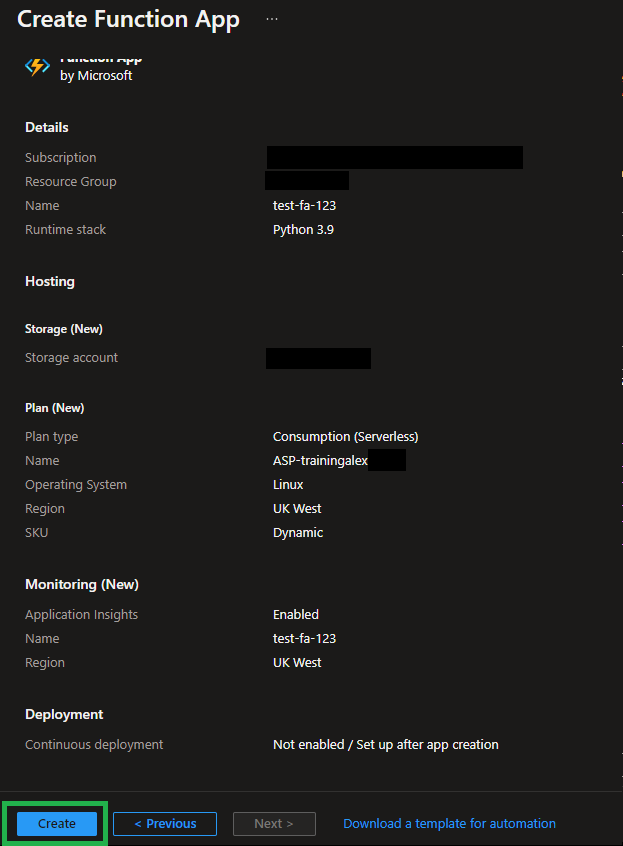
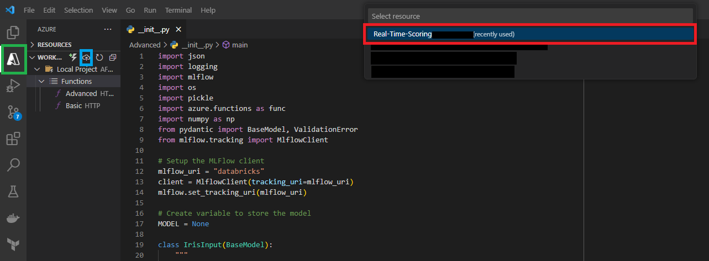

# AF-Model-Scoring
Azure Functions are a fantastic way to deploy real time endpoints for model scoring, this repo will contain a complete guide and code examples on how to quickly and easily deploy your ML models for real time scoring using Azure Functions.

<!-- For more information on *why* Azure functions are such a great tool, and for a more in depth break down of the code please take a look at my blog, [found here](). -->

 **Table of content:**
 - [Local Setup](#item-one)
    - [Python Virtual Environment](#item-one-a)
    - [MLFlow Connection](#item-one-b)
    - [Running the Functions Locally](#item-one-c)
 - [Deployment](#item-two)
    - [Create a Resource Group](#item-two-a)
    - [Create a Function App](#item-two-b)
    - [Deploy the Functions](#item-two-c)

<a id="item-one"></a>
# Local Setup
Below are a set of instruction on how to set up the various tools and services required.

I would recmmend using VSCode to easily create, debug, manage and deploy azure functions.
- [Install VSCode](https://code.visualstudio.com/download)
- [Install the Azure Account Extension](https://marketplace.visualstudio.com/items?itemName=ms-vscode.azure-account)
- [Install the Azure Functions Extension](https://marketplace.visualstudio.com/items?itemName=ms-azuretools.vscode-azurefunctions)
- [Install the .NET Framework](https://learn.microsoft.com/en-us/dotnet/framework/install/)

<a id="item-one-a"></a>
## Python virtual environment
All of the following commands should be run in a terminal on a machine with python installed, a python download can be found [here](https://www.python.org/downloads/).
1) Create the virtual environment:
```
$py -m venv venv
```
2) Activate the virtual enviornment:
```
.\.venv\Scripts\activate
```
3) Done. It is as easy as that!
Bonus step is to install of all the required python packages from the requirements.txt
- Install the requirements:
```
pip install -r requirements.txt
```

<a id="item-one-b"></a>
## MLFlow Connection
As part of the advanced function models will be registered to, and loaded directly from managed MLFlow in Databricks, the below instructions will outline how to connect from your local machine to MLFlow.

If you do not already managed MLFlow you can try it for free using the link [here](https://www.databricks.com/product/managed-mlflow).

1) Generate a token from Databricks by going to *User Settings* -> *Access tokens* -> *Generate new token*
2) Run the following command:
```
databricks configure --token
```
3) Enter the databricks host URL & Token when prompted
4) Create a new MLFlow experiment
    - Select the experiments tab (green)
    - In the dropdown select the option *Create Blank Experiment* (blue)
    - Give the experiment a name

5) Copy the experiment location (green)

6) Create an environment variable for the expierment being used for this demo:
```
set IRIS_EXPERIMENT=<Experiment Location>
```
If you have an MLFlow instance that is not managed by Databricks then you can simply ignore steps 1-3 and instead replace uri with that of your remote tracking servers. Replace line 8 in *Scripts/register_models.py* and line 12 in *Advanced/__init__.py* with:
```
mlflow_uri = "<Remote URI>"
```

<a id="item-one-c"></a>
## Running the Functions Locally
In order to run the Functions locally simply simply run the following command.
```
func start
```
Alternatively you can run the functions using the in-build debugger in VS code, select the debugger (green), then press run (blue) as shown in the image below.



### Basic Function
Once the functions are running locally they can be accessed at `http://localhost:7071/api/<App>`. You can then call the functions by making http requests through cURL, Postman, or similar. 

Below are some example requests that can be made to the Basic Function. All of the models are already packaged and stored in the repo so these will work out of the box.
- This request will return a Prediction of class 1
```
curl --location --request GET 'http://localhost:7071/api/Basic' \
--header 'Content-Type: application/json' \
--data-raw '{
"Sepal_Length": 7.0,
"Sepal_Width": 3.2,
"Petal_Length": 4.7,
"Petal_Width": 1.4
}'
```
- This request will return an error as it provides no body
```
curl --location --request GET 'http://localhost:7071/api/Basic' \
--data-raw ''
```
- The request will return an error as it does not provide a valid body
```
curl --location --request GET 'http://localhost:7071/api/Basic' \
--header 'Content-Type: application/json' \
--data-raw '{
"Height": "6 foot, 3 inches",
"Width": "18inches"
}'
```

### Advanced Function
In order get the advanced functions to load models you will have to register the Random Forest model to MLFlow. Once you have [setup the MLFlow connection and created the experiment](#item-one-b)
1) Run the script `Scripts/register_models.py` to register the models to MLFlow
2) Go to Models (green) in MLFlow and select latest version of the Random Forest model (blue)

3) Transition the model to production (green)

The advanced function will now be able to load the model from MLFlow, below are some example requests.
- This request will return a Prediction of class 1, and will load the model if it is the first time the function has ran
```
curl --location --request GET 'http://localhost:7071/api/Advanced' \
--header 'Content-Type: application/json' \
--data-raw '{
"Sepal_Length": 7.0,
"Sepal_Width": 3.2,
"Petal_Length": 4.7,
"Petal_Width": 1.4
}'
```
- This request will cause the function to reload the model, useful if the version has been updated and you do not want to restart the function app.
```
curl --location --request GET 'http://localhost:7071/api/Advanced/reload' \
--data-raw ''
```
- The request will return a validation error with details on the problems with the input data
```
curl --location --request GET 'http://localhost:7071/api/Advanced' \
--header 'Content-Type: application/json' \
--data-raw '{
"Sepal_Length": 5.1,
"Sepal_Width": 3.5,
"Petal_Width": "not a double"
}'
```
<a id="item-two"></a>
# Deployment
<a id="item-two-a"></a>
## Create a Resource Group
In order to deploy the functions to an end-point you will need a resource group, a resource group is a container that holds related resources for the Azure solution.

You can find a tutorial on how to create a resource group [here](https://learn.microsoft.com/en-us/azure/azure-resource-manager/management/manage-resource-groups-portal)

<a id="item-two-b"></a>
## Create a Function App
1) In the resource group you just made press the create button (green)


2) Search for Function App in the search bar (green), then in the function app press create (blue)


3) Configure the function app by selecting the following settings:
    - Select your Azure subscription and the resource group you just created (green)
    - Give the function app a meaningful name (blue)
    - Select the python Runtime stack, and set the version to 3.9 (red)
    - Select a local region (yellow)
    - Select a plan (white), Consumption (Serverless) is the easiest
    - Press review and create (pink)

    There are additional steps for configuration if you wish for a more personalised setup, but the defaults for these will work just fine.



4) Finally press create (green), wait for approximately 5 minutes for the app to deploy, then you are done



<a id="item-two-c"></a>
## Deploy the Functions
Deploying the function couldn't be easier, simply go to the *Azure Extension* in VSCode (green), select *Deploy* (blue) then select your Function app from the menu (red).



Boom. Function deployed. Head into the Azure portal to get the URL, then you can make requests in the same way as outlined in [Running Functions Locally](#item-one-c) instead just replacing the URL with the URL of the live function.